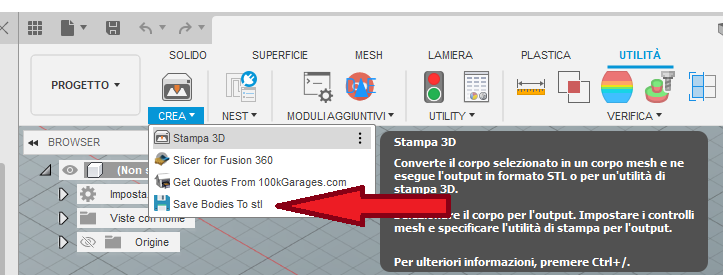

# Fusion360_HH_SaveAll_To_STL
 Save all selected bodies to separated STL file

Installation:
 put HH_SaveAll_To_STL directory into fusion360 Addins directory (in my case: C:\Users\[USERNAME]\AppData\Roaming\Autodesk\Autodesk Fusion 360\API\AddIns)
 then restart fusion 360
 
 you can find a button into Utility tab, under make panel
 
 

Addin per salvare tutti i body selezionati in file stl separati per fusion 360

Installazione:
 Copiare HH_SaveAll_To_STL directory dentro la directory addins di fusion360 (nel mio caso: C:\Users\[USERNAME]\AppData\Roaming\Autodesk\Autodesk Fusion 360\API\AddIns)
 quindi riavviare Fusion 360
 
 Dovreste poi trovare un pulsante nel tab Utilità, all'interno del pannello CREA
 
 

Bye.